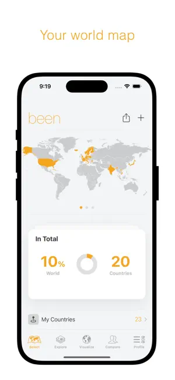
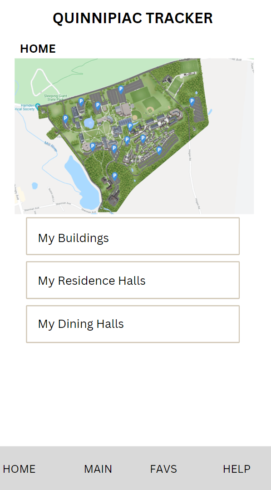
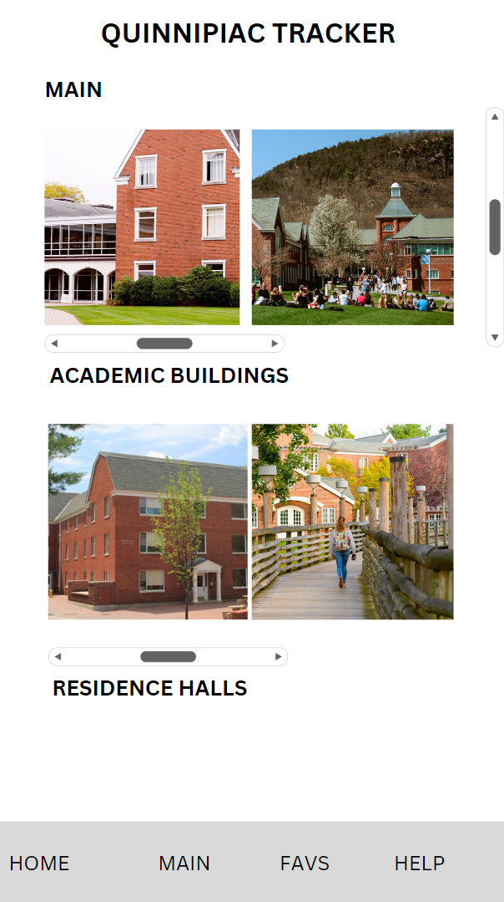

## Table of contents

{: .no_toc .text-delta }

1. TOC
{:toc}

---

# Final Project Proposal

## Introduction

Our idea was to implement a travel-tracker type app, that will allow you to track the places you have been to on the Quinnipiac campus. This is based off of an app called been, which is a large-scale app that gives information about all the different countries in the world, and allows you to mark where you have been, lived, and want to go in the world. We loved this idea, and thought it would be useful for Quinnipiac students, and specifically for more experience being in different places on campus. We liked this idea for both Mount Carmel.

## Description

*been App Home Page*

We wanted the app to have the following features (for Mt. Carmel):

- Allow the user to list the places on campus they’ve been to
- Keep progress of all of the user’s building status
- Show a list all of the different buildings with descriptions
- Show a list all of the residence halls with descriptions
- Show a list all of the dining halls with descriptions
- Show a map of the campus

## Initial Mockup

*Basic idea for app using the mockup for the Home page and Mt. Carmel page*

## User Stories

- As a user, I want to see a list of all of the different academic buildings on the Mount Carmel campus with descriptions, so I can know more information about which building is which
- As a user, I want to see a list of all of the different residence halls on the Mount Carmel campus with descriptions, so I can know more information about which hall is for who
- As a user, I want to see a list of all of the different dining halls on the Mount Carmel campus with descriptions, so I can know more information about which ones are which
- As a user, I want to save a list of buildings on campus, so I can refer to those buildings later
- As a user, I want to see my progress of where I have been on campus, so I can look back and refer to them for future purposes
- As a user, I want to see a map of the Mount Carmel Campus, so I can know where each building is
- As a user, I want there to be a favorites folder, so I can see my favorite buildings
